# Cab Management System

A production-oriented full-stack cab booking and management platform designed for IIT Kharagpur students.

The system manages the complete lifecycle of prayer cab trips — from trip creation and student booking to cab allocation, attendance, post-trip payment collection, email notifications, and administrative analytics.

The application is designed with a strong focus on:

- API performance
- Security
- Authentication
- Persistent state management
- Idempotent operations
- Concurrent request handling
- Database consistency
- Secure payment processing
- Reliable email notifications
- Role-based access control

---

# Table of Contents

- [Overview](#overview)
- [Key Engineering Improvements](#key-engineering-improvements)
- [Technology Stack](#technology-stack)
- [High-Level System Architecture](#high-level-system-architecture)
- [Performance Optimization](#performance-optimization)
- [Persistence Architecture](#persistence-architecture)
- [Idempotency](#idempotency)
- [Authentication and Security Architecture](#authentication-and-security-architecture)
- [PKCE Authentication](#pkce-authentication)
- [Registration Flow](#registration-flow)
- [Login Flow](#login-flow)
- [Trip Creation Workflow](#trip-creation-workflow)
- [Email Notification Workflow](#email-notification-workflow)
- [Trip Booking Workflow](#trip-booking-workflow)
- [Cab Allocation Workflow](#cab-allocation-workflow)
- [Post-Trip Payment Workflow](#post-trip-payment-workflow)
- [Database and Data Integrity](#database-and-data-integrity)
- [API Request Lifecycle](#api-request-lifecycle)
- [Security Architecture](#security-architecture)
- [Error Handling](#error-handling)
- [Project Structure](#project-structure)
- [Deployment Architecture](#deployment-architecture)
- [Engineering Highlights](#engineering-highlights)
- [Future Improvements](#future-improvements)

---

# Overview

The Cab Management System provides two primary interfaces:

### Student/User Portal

Students can:

- Browse available trips
- Book available trips
- View booking status
- Track cab assignments
- View attendance/payment status
- Complete post-trip payments

### Admin Panel

Administrators can:

- Create and manage trips
- Configure booking windows
- Allocate vehicles
- Manage bookings
- Record attendance
- Open/close payment windows
- Configure trip costs
- Manage users
- Manage administrator privileges
- Monitor revenue and analytics

A major business requirement is that:

> **Students do not pay during booking. Payment is collected after the trip has been completed.**

---

# Key Engineering Improvements

The system has undergone significant backend and infrastructure improvements focused on performance, reliability, security, and consistency.

### Major improvements

- Reduced API latency through optimized database access
- Parallelized independent database operations
- Reduced unnecessary sequential API requests
- Reduced redundant database queries
- Eliminated unnecessary database connection-pooling overhead
- Added persistent database-backed application state
- Implemented idempotent state-changing operations
- Added PKCE-based authentication
- Added authentication and authorization checks
- Added role-based administrative access
- Added API-level input validation
- Added rate limiting
- Added HTTP security headers
- Added structured error handling
- Added database-level integrity protection
- Improved concurrent request handling
- Added reliable email notification workflows
- Improved production reliability of PostgreSQL/Supabase-backed operations

---

# Technology Stack

## Frontend

| Technology | Purpose |
|---|---|
| React | UI framework |
| TypeScript | Type safety |
| Vite | Frontend build tooling |
| Tailwind CSS | Styling |
| shadcn/ui | UI components |
| React Router DOM | Client-side routing |
| Axios | HTTP/API communication |

## Backend

| Technology | Purpose |
|---|---|
| Node.js | Runtime |
| Express.js | REST API framework |
| TypeScript | Backend type safety |
| Prisma ORM | Database access |
| PostgreSQL | Persistent relational database |
| Zod | Request/input validation |
| Passport.js | Authentication middleware |
| Helmet | HTTP security headers |
| Rate Limiting | API abuse protection |

## Authentication

- PKCE
- JWT/session-based authentication
- Authentication middleware
- Role-based authorization
- Protected administrative routes

## External Services

| Service | Purpose |
|---|---|
| Supabase/PostgreSQL | Persistent database/authentication infrastructure |
| Razorpay | Payment processing |
| Nodemailer | Email notifications |

---

# High-Level System Architecture
1. High-Level System Architecture
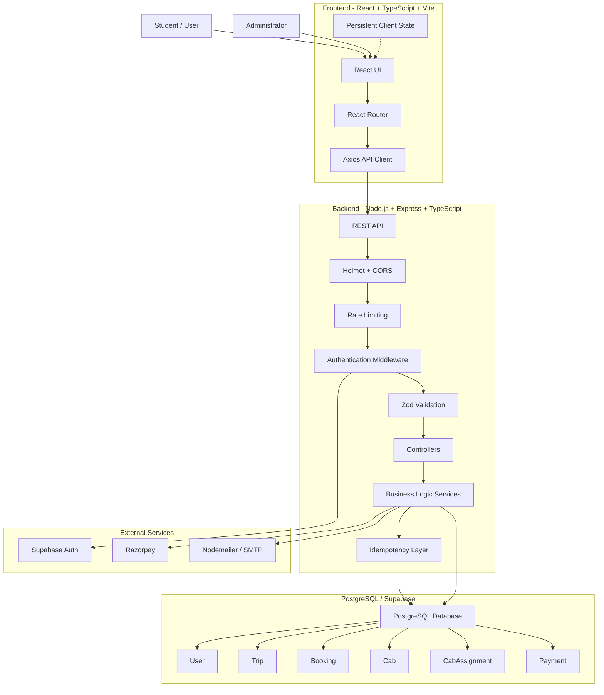
```mermaid
flowchart TB
    User["Student / User"]
    Admin["Administrator"]

    subgraph Frontend["Frontend - React + TypeScript + Vite"]
        UI["React UI"]
        Router["React Router"]
        Axios["Axios API Client"]
        State["Persistent Client State"]
    end

    subgraph Backend["Backend - Node.js + Express + TypeScript"]
        API["REST API"]
        Auth["Authentication Middleware"]
        Validation["Zod Validation"]
        RateLimit["Rate Limiting"]
        Security["Helmet + CORS"]
        Controllers["Controllers"]
        Services["Business Logic Services"]
        Idempotency["Idempotency Layer"]
    end

    subgraph Database["PostgreSQL / Supabase"]
        DB["PostgreSQL Database"]
        Users["User"]
        Trips["Trip"]
        Bookings["Booking"]
        Cabs["Cab"]
        Assignments["CabAssignment"]
        Payments["Payment"]
    end

    subgraph External["External Services"]
        SupabaseAuth["Supabase Auth"]
        Razorpay["Razorpay"]
        Email["Nodemailer / SMTP"]
    end

    User --> UI
    Admin --> UI

    UI --> Router
    Router --> Axios
    Axios --> API

    API --> Security
    Security --> RateLimit
    RateLimit --> Auth
    Auth --> Validation
    Validation --> Controllers
    Controllers --> Services
    Services --> Idempotency

    Idempotency --> DB
    Services --> DB

    Auth --> SupabaseAuth
    Services --> Razorpay
    Services --> Email

    DB --> Users
    DB --> Trips
    DB --> Bookings
    DB --> Cabs
    DB --> Assignments
    DB --> Payments

    State -.-> UI
```

Authentication Architecture — PKCE(Proof Key for Code Exchange) to protect the authorization flow and prevent authorization-code interception attacks.
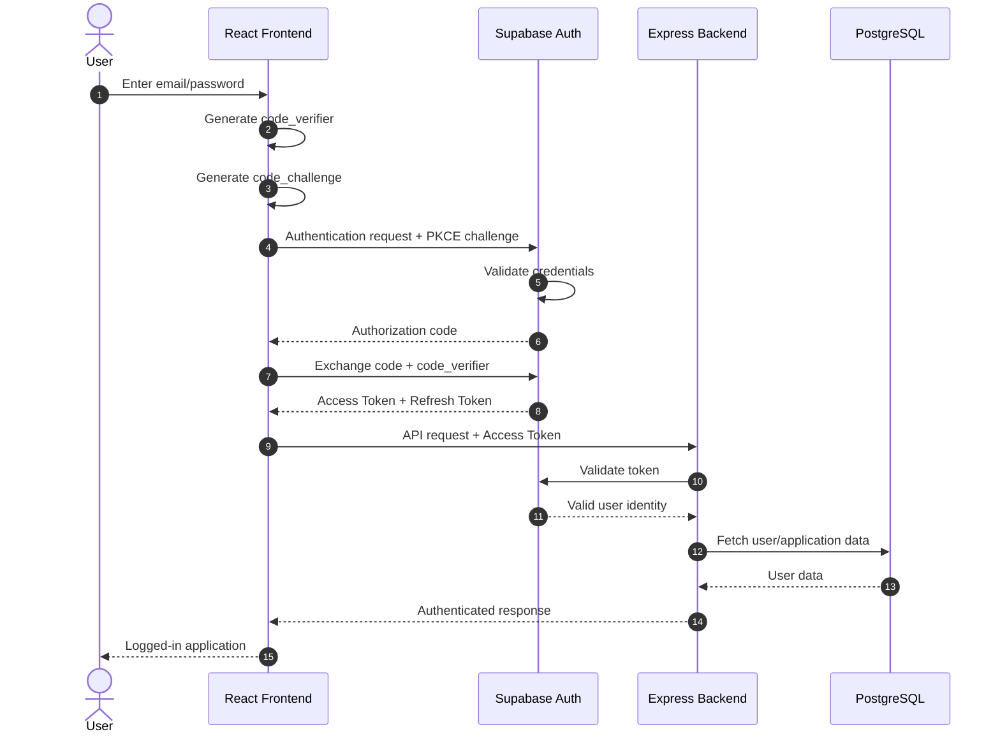
```mermaid
sequenceDiagram
    autonumber

    actor User
    participant Browser as React Frontend
    participant Auth as Supabase Auth
    participant API as Express Backend
    participant DB as PostgreSQL

    User->>Browser: Enter email/password
    Browser->>Browser: Generate code_verifier
    Browser->>Browser: Generate code_challenge

    Browser->>Auth: Authentication request + PKCE challenge
    Auth->>Auth: Validate credentials

    Auth-->>Browser: Authorization code
    Browser->>Auth: Exchange code + code_verifier

    Auth-->>Browser: Access Token + Refresh Token

    Browser->>API: API request + Access Token
    API->>Auth: Validate token

    Auth-->>API: Valid user identity

    API->>DB: Fetch user/application data
    DB-->>API: User data

    API-->>Browser: Authenticated response
    Browser-->>User: Logged-in application
```

3. Registration Flow
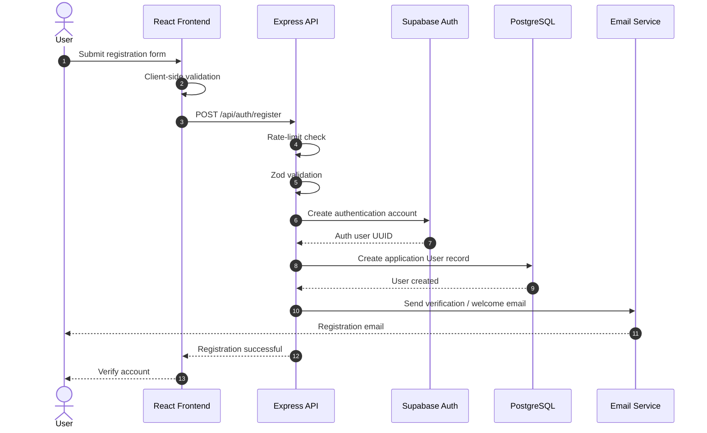
```mermaid
sequenceDiagram
    autonumber

    actor User
    participant Frontend as React Frontend
    participant API as Express API
    participant Auth as Supabase Auth
    participant DB as PostgreSQL
    participant Email as Email Service

    User->>Frontend: Submit registration form

    Frontend->>Frontend: Client-side validation
    Frontend->>API: POST /api/auth/register

    API->>API: Rate-limit check
    API->>API: Zod validation

    API->>Auth: Create authentication account
    Auth-->>API: Auth user UUID

    API->>DB: Create application User record
    DB-->>API: User created

    API->>Email: Send verification / welcome email
    Email-->>User: Registration email

    API-->>Frontend: Registration successful
    Frontend-->>User: Verify account
```

4. Login Flow
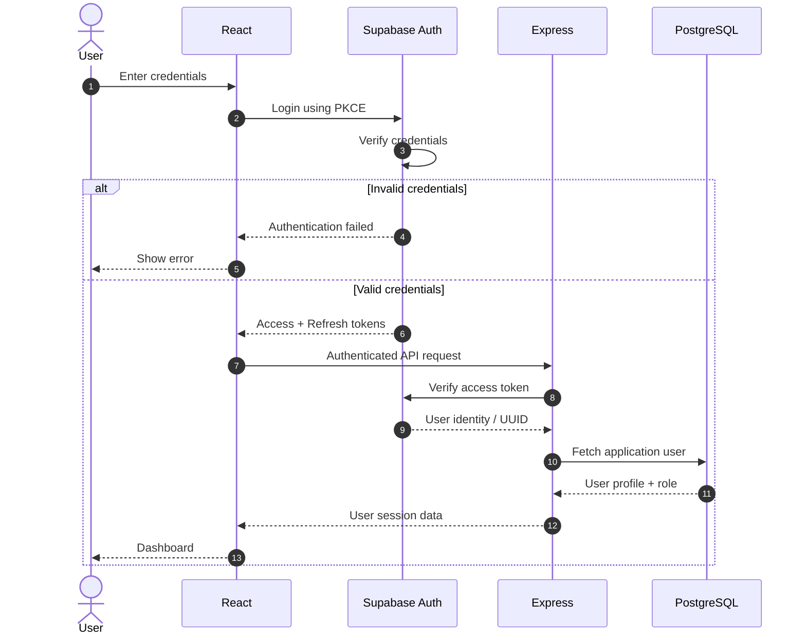
```mermaid
sequenceDiagram
    autonumber

    actor User
    participant Frontend as React
    participant Auth as Supabase Auth
    participant API as Express
    participant DB as PostgreSQL

    User->>Frontend: Enter credentials

    Frontend->>Auth: Login using PKCE
    Auth->>Auth: Verify credentials

    alt Invalid credentials
        Auth-->>Frontend: Authentication failed
        Frontend-->>User: Show error
    else Valid credentials
        Auth-->>Frontend: Access + Refresh tokens

        Frontend->>API: Authenticated API request
        API->>Auth: Verify access token

        Auth-->>API: User identity / UUID

        API->>DB: Fetch application user
        DB-->>API: User profile + role

        API-->>Frontend: User session data
        Frontend-->>User: Dashboard
    end
```

5. Trip Creation Workflow
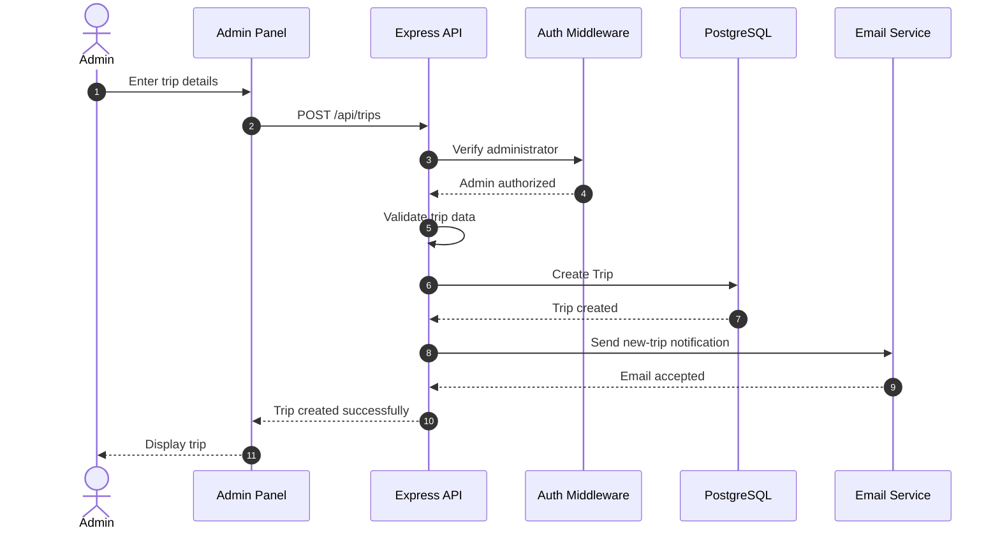
```mermaid
sequenceDiagram
    autonumber

    actor Admin
    participant UI as Admin Panel
    participant API as Express API
    participant Auth as Auth Middleware
    participant DB as PostgreSQL
    participant Email as Email Service

    Admin->>UI: Enter trip details
    UI->>API: POST /api/trips

    API->>Auth: Verify administrator
    Auth-->>API: Admin authorized

    API->>API: Validate trip data

    API->>DB: Create Trip
    DB-->>API: Trip created

    API->>Email: Send new-trip notification
    Email-->>API: Email accepted

    API-->>UI: Trip created successfully
    UI-->>Admin: Display trip
```

6. Trip Creation + Email Notification Architecture
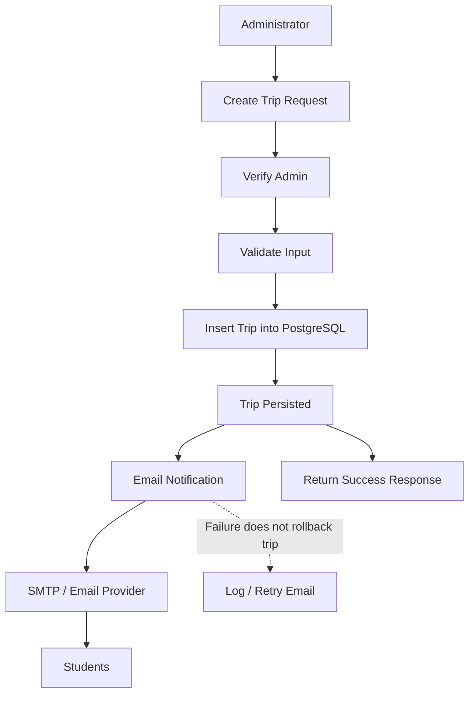
```mermaid
flowchart TD
    Admin["Administrator"]

    Create["Create Trip Request"]
    Validate["Validate Input"]
    Auth["Verify Admin"]
    DB["Insert Trip into PostgreSQL"]
    Commit["Trip Persisted"]
    EmailQueue["Email Notification"]
    SMTP["SMTP / Email Provider"]
    Users["Students"]

    Admin --> Create
    Create --> Auth
    Auth --> Validate
    Validate --> DB
    DB --> Commit

    Commit --> EmailQueue
    EmailQueue --> SMTP
    SMTP --> Users

    Commit --> Response["Return Success Response"]

    EmailQueue -. "Failure does not rollback trip" .-> Error["Log / Retry Email"]
```

7. User Booking Workflow
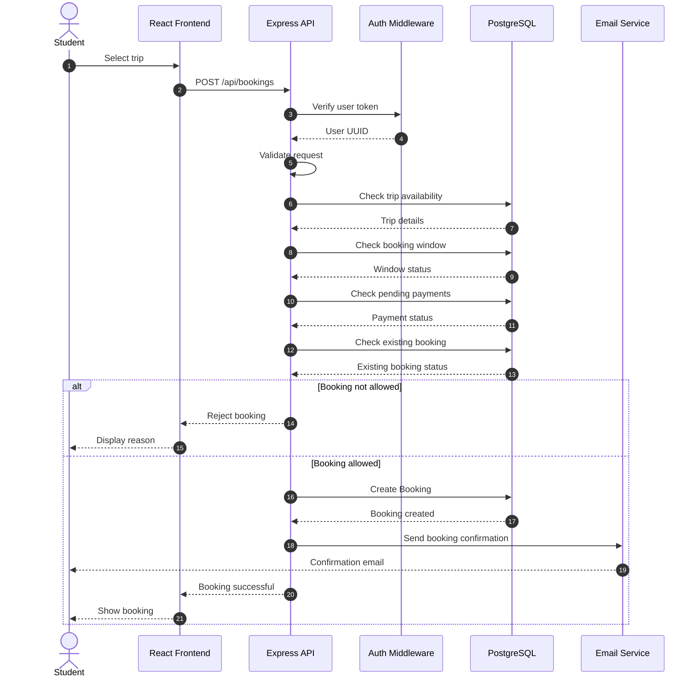
```mermaid
sequenceDiagram
    autonumber

    actor Student
    participant UI as React Frontend
    participant API as Express API
    participant Auth as Auth Middleware
    participant DB as PostgreSQL
    participant Email as Email Service

    Student->>UI: Select trip
    UI->>API: POST /api/bookings

    API->>Auth: Verify user token
    Auth-->>API: User UUID

    API->>API: Validate request

    API->>DB: Check trip availability
    DB-->>API: Trip details

    API->>DB: Check booking window
    DB-->>API: Window status

    API->>DB: Check pending payments
    DB-->>API: Payment status

    API->>DB: Check existing booking
    DB-->>API: Existing booking status

    alt Booking not allowed
        API-->>UI: Reject booking
        UI-->>Student: Display reason
    else Booking allowed
        API->>DB: Create Booking
        DB-->>API: Booking created

        API->>Email: Send booking confirmation
        Email-->>Student: Confirmation email

        API-->>UI: Booking successful
        UI-->>Student: Show booking
    end
```

8. Idempotent Booking Design
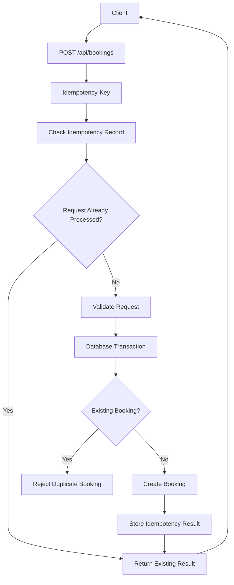
```mermaid
flowchart TD
    Client["Client"]

    Request["POST /api/bookings"]
    Key["Idempotency-Key"]
    Check["Check Idempotency Record"]

    Existing{"Request Already Processed?"}

    Return["Return Existing Result"]
    Validate["Validate Request"]
    Transaction["Database Transaction"]

    Duplicate{"Existing Booking?"}

    Reject["Reject Duplicate Booking"]
    Create["Create Booking"]
    Store["Store Idempotency Result"]

    Client --> Request
    Request --> Key
    Key --> Check
    Check --> Existing

    Existing -->|Yes| Return
    Existing -->|No| Validate

    Validate --> Transaction
    Transaction --> Duplicate

    Duplicate -->|Yes| Reject
    Duplicate -->|No| Create

    Create --> Store
    Store --> Return

    Return --> Client
```

9. Persistent State Management

The application does not rely solely on temporary frontend state.

Important business state is persisted in PostgreSQL so that it survives:

Browser refresh
Frontend restart
Backend restart
Server redeployment
Multiple simultaneous clients
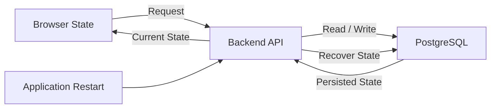
```mermaid
flowchart LR
    Browser["Browser State"]
    API["Backend API"]
    DB["PostgreSQL"]

    Browser -->|Request| API
    API -->|Read / Write| DB

    DB -->|Persisted State| API
    API -->|Current State| Browser

    Restart["Application Restart"] --> API
    API -->|Recover State| DB
```

10. Persistent Booking State
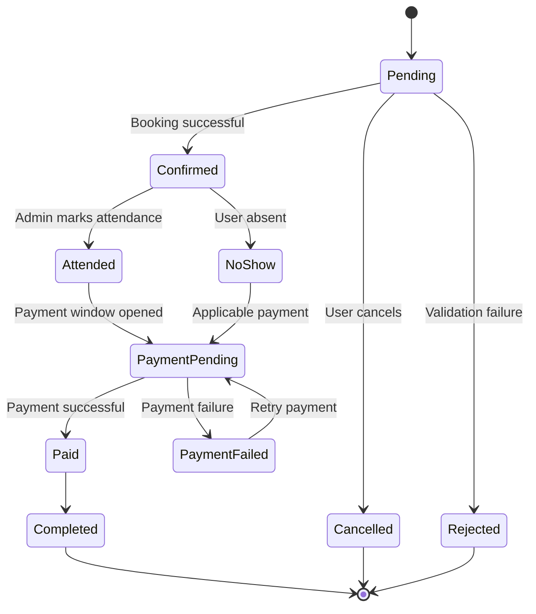
```mermaid
stateDiagram-v2
    [*] --> Pending

    Pending --> Confirmed: Booking successful
    Pending --> Cancelled: User cancels
    Pending --> Rejected: Validation failure

    Confirmed --> Attended: Admin marks attendance
    Confirmed --> NoShow: User absent

    Attended --> PaymentPending: Payment window opened
    NoShow --> PaymentPending: Applicable payment

    PaymentPending --> Paid: Payment successful
    PaymentPending --> PaymentFailed: Payment failure

    PaymentFailed --> PaymentPending: Retry payment

    Paid --> Completed

    Cancelled --> [*]
    Rejected --> [*]
    Completed --> [*]
```

11. Cab Allocation Workflow
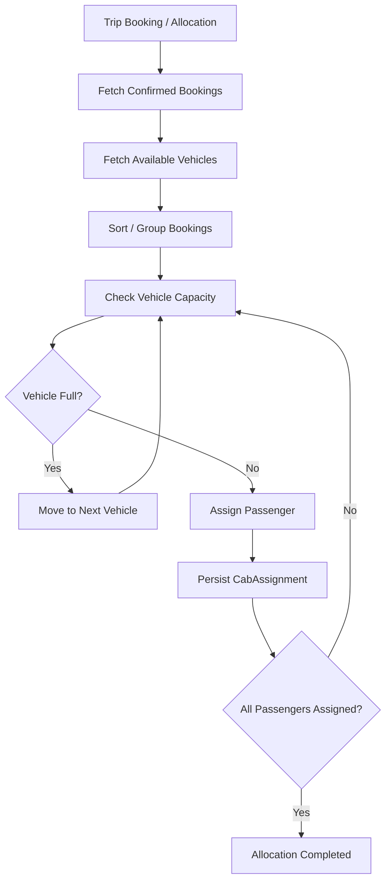
```mermaid
flowchart TD
    Start["Trip Booking / Allocation"]

    GetBookings["Fetch Confirmed Bookings"]
    GetVehicles["Fetch Available Vehicles"]

    Sort["Sort / Group Bookings"]
    Capacity["Check Vehicle Capacity"]

    Full{"Vehicle Full?"}

    Next["Move to Next Vehicle"]
    Assign["Assign Passenger"]
    Persist["Persist CabAssignment"]

    Complete{"All Passengers Assigned?"}

    End["Allocation Completed"]

    Start --> GetBookings
    GetBookings --> GetVehicles
    GetVehicles --> Sort
    Sort --> Capacity

    Capacity --> Full

    Full -->|Yes| Next
    Next --> Capacity

    Full -->|No| Assign
    Assign --> Persist
    Persist --> Complete

    Complete -->|No| Capacity
    Complete -->|Yes| End
```

12. Trip Lifecycle

This gives the complete business lifecycle of a trip.
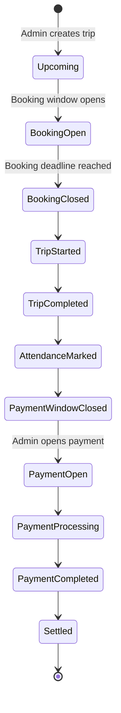
```mermaid
stateDiagram-v2
    [*] --> Upcoming: Admin creates trip

    Upcoming --> BookingOpen: Booking window opens
    BookingOpen --> BookingClosed: Booking deadline reached

    BookingClosed --> TripStarted
    TripStarted --> TripCompleted

    TripCompleted --> AttendanceMarked
    AttendanceMarked --> PaymentWindowClosed

    PaymentWindowClosed --> PaymentOpen: Admin opens payment

    PaymentOpen --> PaymentProcessing
    PaymentProcessing --> PaymentCompleted

    PaymentCompleted --> Settled
    Settled --> [*]
```

13. Payment Workflow

Payment occurs after trip completion, according to the business logic.
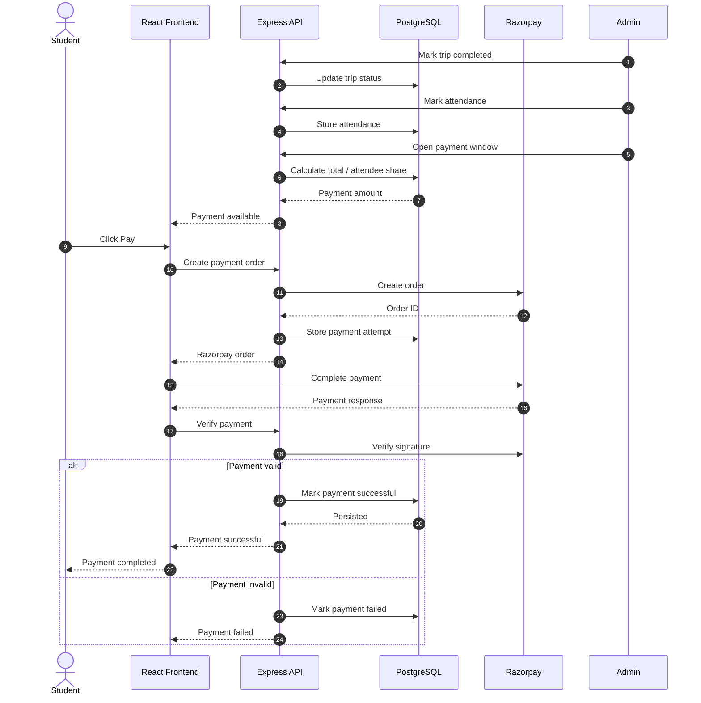
```mermaid
sequenceDiagram
    autonumber

    actor Student
    participant UI as React Frontend
    participant API as Express API
    participant DB as PostgreSQL
    participant Razorpay as Razorpay

    Admin->>API: Mark trip completed
    API->>DB: Update trip status

    Admin->>API: Mark attendance
    API->>DB: Store attendance

    Admin->>API: Open payment window
    API->>DB: Calculate total / attendee share
    DB-->>API: Payment amount

    API-->>UI: Payment available

    Student->>UI: Click Pay
    UI->>API: Create payment order

    API->>Razorpay: Create order
    Razorpay-->>API: Order ID

    API->>DB: Store payment attempt
    API-->>UI: Razorpay order

    UI->>Razorpay: Complete payment
    Razorpay-->>UI: Payment response

    UI->>API: Verify payment
    API->>Razorpay: Verify signature

    alt Payment valid
        API->>DB: Mark payment successful
        DB-->>API: Persisted
        API-->>UI: Payment successful
        UI-->>Student: Payment completed
    else Payment invalid
        API->>DB: Mark payment failed
        API-->>UI: Payment failed
    end
```

14. Payment Idempotency

Payment operations must be idempotent because Razorpay callbacks, browser retries, network retries, or duplicate requests must not create duplicate payment records.
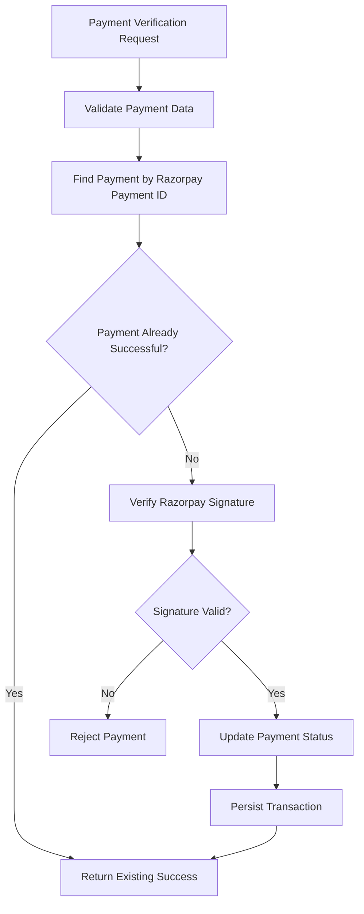
```mermaid
flowchart TD
    Request["Payment Verification Request"]

    Validate["Validate Payment Data"]

    Lookup["Find Payment by Razorpay Payment ID"]

    Exists{"Payment Already Successful?"}

    Return["Return Existing Success"]

    Verify["Verify Razorpay Signature"]

    Valid{"Signature Valid?"}

    Reject["Reject Payment"]

    Update["Update Payment Status"]

    Persist["Persist Transaction"]

    Request --> Validate
    Validate --> Lookup
    Lookup --> Exists

    Exists -->|Yes| Return
    Exists -->|No| Verify

    Verify --> Valid

    Valid -->|No| Reject
    Valid -->|Yes| Update

    Update --> Persist
    Persist --> Return
```

15. Email Notification Workflow
Email sending should not unnecessarily block the critical database operation.
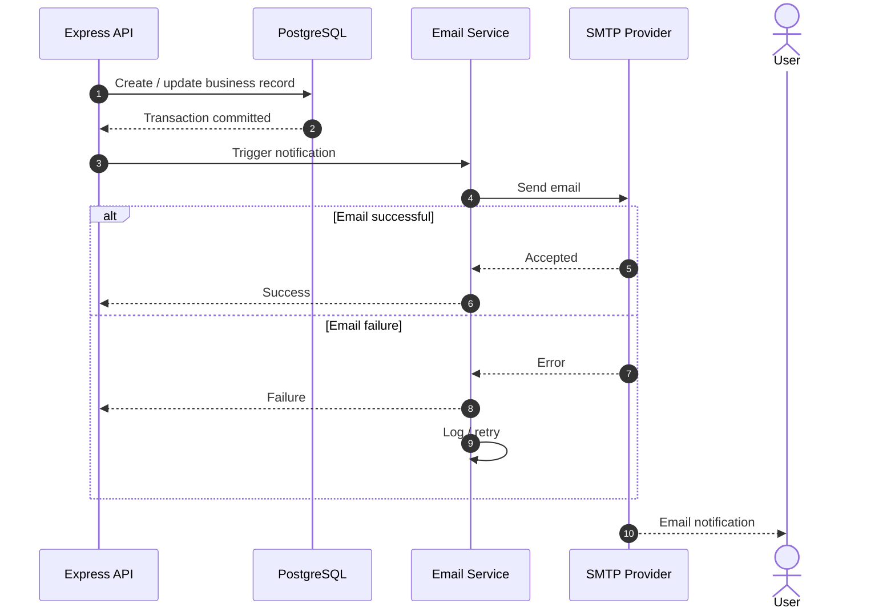
```mermaid
sequenceDiagram
    autonumber

    participant API as Express API
    participant DB as PostgreSQL
    participant Email as Email Service
    participant SMTP as SMTP Provider
    actor User

    API->>DB: Create / update business record
    DB-->>API: Transaction committed

    API->>Email: Trigger notification

    Email->>SMTP: Send email

    alt Email successful
        SMTP-->>Email: Accepted
        Email-->>API: Success
    else Email failure
        SMTP-->>Email: Error
        Email-->>API: Failure
        Email->>Email: Log / retry
    end

    SMTP-->>User: Email notification
```

16. Email Idempotency

The same event should not generate multiple emails when an API request is retried.
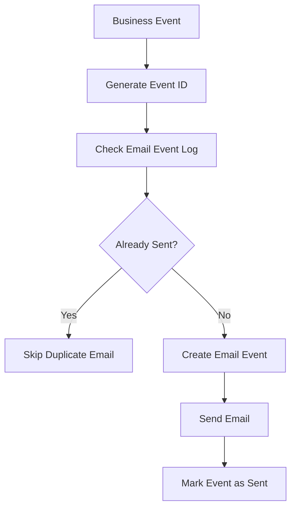
```mermaid
flowchart TD
    Event["Business Event"]

    EventID["Generate Event ID"]

    Check["Check Email Event Log"]

    Exists{"Already Sent?"}

    Skip["Skip Duplicate Email"]

    Create["Create Email Event"]
    Send["Send Email"]
    Mark["Mark Event as Sent"]

    Event --> EventID
    EventID --> Check
    Check --> Exists

    Exists -->|Yes| Skip
    Exists -->|No| Create

    Create --> Send
    Send --> Mark
```

17. API Performance Optimization

The major latency improvement came from eliminating unnecessary sequential operations and executing independent operations concurrently.
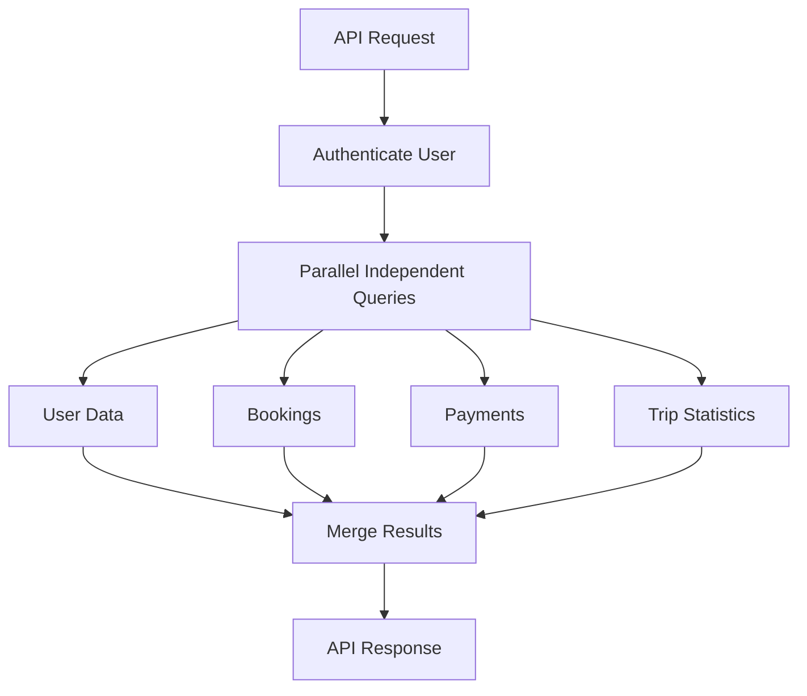
```mermaid
flowchart TD
    Request["API Request"]

    Auth["Authenticate User"]

    Parallel["Parallel Independent Queries"]

    Q1["User Data"]
    Q2["Bookings"]
    Q3["Payments"]
    Q4["Trip Statistics"]

    Merge["Merge Results"]

    Response["API Response"]

    Request --> Auth
    Auth --> Parallel

    Parallel --> Q1
    Parallel --> Q2
    Parallel --> Q3
    Parallel --> Q4

    Q1 --> Merge
    Q2 --> Merge
    Q3 --> Merge
    Q4 --> Merge

    Merge --> Response
```

Before
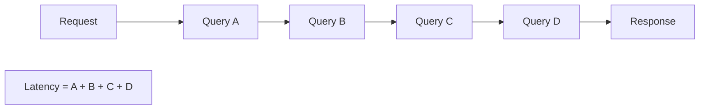
```mermaid
flowchart LR
    A["Request"] --> B["Query A"]
    B --> C["Query B"]
    C --> D["Query C"]
    D --> E["Query D"]
    E --> F["Response"]

    L["Latency = A + B + C + D"]
```

After
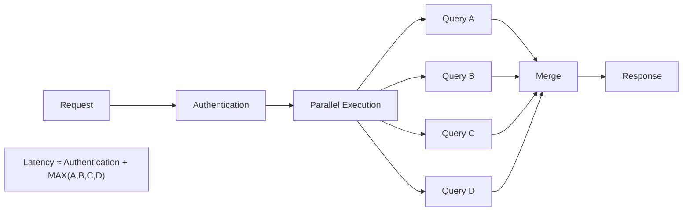
```mermaid
flowchart LR
    A["Request"] --> B["Authentication"]

    B --> C["Parallel Execution"]

    C --> Q1["Query A"]
    C --> Q2["Query B"]
    C --> Q3["Query C"]
    C --> Q4["Query D"]

    Q1 --> M["Merge"]
    Q2 --> M
    Q3 --> M
    Q4 --> M

    M --> R["Response"]

    L["Latency ≈ Authentication + MAX(A,B,C,D)"]
```

19. Security Architecture
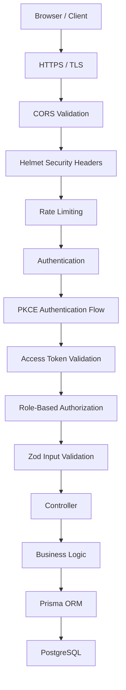
```mermaid
flowchart TD
    Client["Browser / Client"]

    HTTPS["HTTPS / TLS"]

    CORS["CORS Validation"]
    Helmet["Helmet Security Headers"]
    Rate["Rate Limiting"]

    Auth["Authentication"]
    PKCE["PKCE Authentication Flow"]

    JWT["Access Token Validation"]
    Role["Role-Based Authorization"]

    Zod["Zod Input Validation"]

    Controller["Controller"]
    Service["Business Logic"]

    Prisma["Prisma ORM"]
    DB["PostgreSQL"]

    Client --> HTTPS
    HTTPS --> CORS
    CORS --> Helmet
    Helmet --> Rate

    Rate --> Auth
    Auth --> PKCE
    PKCE --> JWT
    JWT --> Role

    Role --> Zod
    Zod --> Controller
    Controller --> Service
    Service --> Prisma
    Prisma --> DB
```

20. Login Security Layers
```mermaid
flowchart TD
    Login["Login Request"]

    HTTPS["HTTPS"]
    Rate["Rate Limiter"]

    PKCE["PKCE Verification"]
    Auth["Supabase Authentication"]

    Token["Access Token"]

    Middleware["Authentication Middleware"]

    JWT["JWT / Token Validation"]

    Role["Role Authorization"]

    API["Protected API"]

    Login --> HTTPS
    HTTPS --> Rate
    Rate --> PKCE
    PKCE --> Auth

    Auth --> Token
    Token --> Middleware
    Middleware --> JWT
    JWT --> Role
    Role --> API
```

21. Authorization / Role-Based Access Control
```mermaid
flowchart TD
    Request["Incoming API Request"]

    Token["Access Token"]
    Verify["Verify Token"]

    User["Authenticated User"]

    RoleCheck{"Required Role?"}

    Student["Student API"]
    Admin["Admin API"]

    Denied["403 Forbidden"]

    Request --> Token
    Token --> Verify
    Verify --> User

    User --> RoleCheck

    RoleCheck -->|Student| Student
    RoleCheck -->|Administrator| Admin
    RoleCheck -->|Unauthorized| Denied
```

22. Complete Booking System — End-to-End
This is the combined workflow diagram showing how the major components interact.
```mermaid
flowchart TD
    Admin["Administrator"]
    Student["Student"]

    subgraph Frontend["React Frontend"]
        AdminUI["Admin Panel"]
        UserUI["Student Portal"]
    end

    subgraph API["Express Backend"]
        Auth["Authentication"]
        Validation["Validation"]
        TripService["Trip Service"]
        BookingService["Booking Service"]
        CabService["Cab Allocation"]
        PaymentService["Payment Service"]
        EmailService["Email Service"]
        Idempotency["Idempotency Layer"]
    end

    subgraph DB["PostgreSQL"]
        TripDB["Trips"]
        BookingDB["Bookings"]
        UserDB["Users"]
        CabDB["Cabs"]
        AssignmentDB["Assignments"]
        PaymentDB["Payments"]
        EventDB["Idempotency / Event Records"]
    end

    subgraph External["External Services"]
        Supabase["Supabase Auth"]
        Razorpay["Razorpay"]
        SMTP["SMTP / Email"]
    end

    Admin --> AdminUI
    Student --> UserUI

    AdminUI --> Auth
    UserUI --> Auth

    Auth --> Supabase

    AdminUI --> Validation
    UserUI --> Validation

    Validation --> TripService
    Validation --> BookingService
    Validation --> CabService
    Validation --> PaymentService

    TripService --> TripDB
    BookingService --> Idempotency
    Idempotency --> BookingDB

    CabService --> CabDB
    CabService --> AssignmentDB

    PaymentService --> PaymentDB
    PaymentService --> Razorpay

    TripService --> EmailService
    BookingService --> EmailService
    PaymentService --> EmailService

    EmailService --> SMTP

    Idempotency --> EventDB

    UserDB --> Auth
```

23. Complete System Lifecycle
```mermaid
flowchart LR
    A["Admin Creates Trip"]
    B["Trip Persisted"]
    C["Email Notification"]
    D["Booking Window Opens"]
    E["Student Books"]
    F["Booking Persisted"]
    G["Cab Allocation"]
    H["Trip Completed"]
    I["Attendance Marked"]
    J["Payment Window Opens"]
    K["Student Pays"]
    L["Payment Verified"]
    M["Payment Persisted"]
    N["Trip Settled"]

    A --> B
    B --> C
    B --> D
    D --> E
    E --> F
    F --> G
    G --> H
    H --> I
    I --> J
    J --> K
    K --> L
    L --> M
    M --> N
```

24. Reliability Model
```mermaid
flowchart TD
    Request["Client Request"]

    Validation["Input Validation"]
    Auth["Authentication"]
    Authorization["Authorization"]
    Idempotency["Idempotency Check"]
    Transaction["Database Transaction"]

    Success["Successful Operation"]
    Retry["Safe Retry"]
    Failure["Controlled Failure"]
    Rollback["Transaction Rollback"]

    Request --> Validation
    Validation --> Auth
    Auth --> Authorization
    Authorization --> Idempotency
    Idempotency --> Transaction

    Transaction --> Success

    Transaction --> Failure
    Failure --> Rollback

    Request -. "Retry" .-> Idempotency
    Idempotency --> Retry
    Retry --> Success
```

